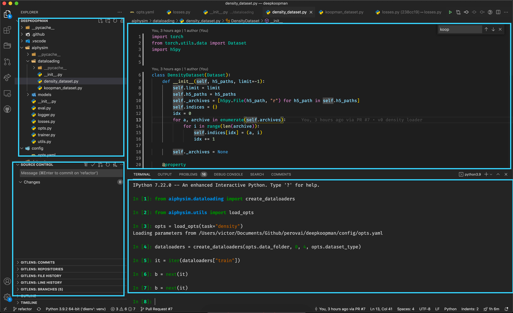

This post contains my personal experience and setup (local development using macOS, remote cluster usage with Linux using SLURM). It's surely not optimal but I think it's a reasonable middle ground between professional software engineering and quick-and-dirty experimental iterations.

# Tooling

I use [**VSCode**](https://code.visualstudio.com/) to code. It's extremely versatile, acceptably user-friendly and its community is very active so there's always an extension for what you need or an answer to your question online.

^*Top left: file explorer. Top right: code editor, writing Python code. Bottom left: Source control: tracking changes with git. Bottom right: local dev using ipython.*

To navigate 